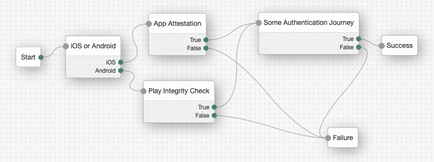
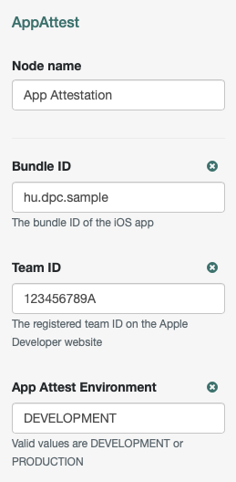
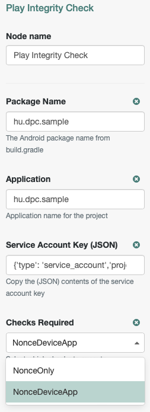

<!--
 * The contents of this file are subject to the terms of the Common Development and
 * Distribution License (the License). You may not use this file except in compliance with the
 * License.
 *
 * You can obtain a copy of the License at legal/CDDLv1.0.txt. See the License for the
 * specific language governing permission and limitations under the License.
 *
 * When distributing Covered Software, include this CDDL Header Notice in each file and include
 * the License file at legal/CDDLv1.0.txt. If applicable, add the following below the CDDL
 * Header, with the fields enclosed by brackets [] replaced by your own identifying
 * information: "Portions copyright [year] [name of copyright owner]".
 *
 * Copyright 2022 ForgeRock AS.
 *
 * Portions Copyright 2023 DPC Consulting Kft
 *
 * Includes App Attestation library by Vincent Haupert
 * from https://github.com/veehaitch/devicecheck-appattest/tree/v0.9.4 (Apache License 2.0)
 *
-->
# Mobile app integrity check authentication nodes

Two simple authentication nodes for ForgeRock's [Identity Platform][forgerock_platform] 7.2.0 and above. 
One node implements Apple's iOS App Attestation. https://developer.apple.com/documentation/devicecheck
The attestation checking logic uses the App Attestation library by Vincent Haupert [https://github.com/veehaitch/devicecheck-appattest/tree/v0.9.4](https://github.com/veehaitch/devicecheck-appattest/tree/v0.9.4) (Apache License 2.0)

The other one is using Google Play Integrity to check the Android app. https://developer.android.com/google/play/integrity/overview


**BUILDING INSTRUCTIONS**


- Clone the repository and build the project using maven.
- Copy the .jar file from the `../target` directory into `<CATALINA_HOME>/webapps/<am-context-root>/WEB-INF/lib/` where AM is deployed.
- Copy the dependencies into `WEB-INF/lib` too.
- Restart the web container to pick up the new node.  The node will then appear in the authentication trees components palette.


The code in this repository has binary dependencies that live in the ForgeRock maven repository. Maven can be configured to authenticate to this repository by following the following [ForgeRock Knowledge Base Article](https://backstage.forgerock.com/knowledge/kb/article/a74096897).

**DEPLOYMENT**

The below are needed in `<catalina_home>/webapps/<context_root>/WEB-INF/lib`:

```shell
# the integrity check nodes build
integrityCheckNodes-1.1.0-SNAPSHOT.jar
```

```shell
# for App Attest
devicecheck-appattest-0.9.4.jar
kotlin-stdlib-jdk8-1.7.10.jar
kotlinx-coroutines-core-jvm-1.6.4.jar
kotlin-reflect-1.5.30.jar
annotations-13.0.jar
kotlin-stdlib-1.7.10.jar
kotlin-stdlib-common-1.7.10.jar
jackson-module-kotlin-2.13.4.jar

# for Play Integrity
google-api-client-2.2.0.jar
google-api-services-playintegrity-v1-rev20230105-2.0.0.jar
```

Make sure the AM version has the below libraries already. If using an older AM, you might have to replace the <1.70 versions of Bouncy Castle with the below versions.
```shell
# Bouncy Castle 1.70
bcpkix-jdk15on-1.70.jar
bcprov-jdk15on-1.70.jar
bcutil-jdk15on-1.70.jar
bcmail-jdk15on-1.70.jar
```

All the above jars are available in Maven Central, see their artifact IDs in [`pom.xml`](pom.xml).

**USAGE**

App Attestation

- sends a `MetadataCallback` containing the challenge
- a `HiddenValueCallback` for the attestation
- and another `HiddenValueCallback` for the keyID

Play Integrity

- sends a `MetadataCallback` containing the nonce
- a `HiddenValueCallback` for the token

**Sample authentication tree**




        
The sample code described herein is provided on an "as is" basis, without warranty of any kind, to the fullest extent permitted by law. ForgeRock does not warrant or guarantee the individual success developers may have in implementing the sample code on their development platforms or in production configurations.

ForgeRock or DPC Consulting Kft does not warrant, guarantee or make any representations regarding the use, results of use, accuracy, timeliness or completeness of any data or information relating to the sample code. ForgeRock disclaims all warranties, expressed or implied, and in particular, disclaims all warranties of merchantability, and warranties related to the code, or any service or software related thereto.

ForgeRock or DPC Consulting Kft shall not be liable for any direct, indirect or consequential damages or costs of any type arising out of any action taken by you or others related to the sample code.

[forgerock_platform]: https://www.forgerock.com/platform/  
